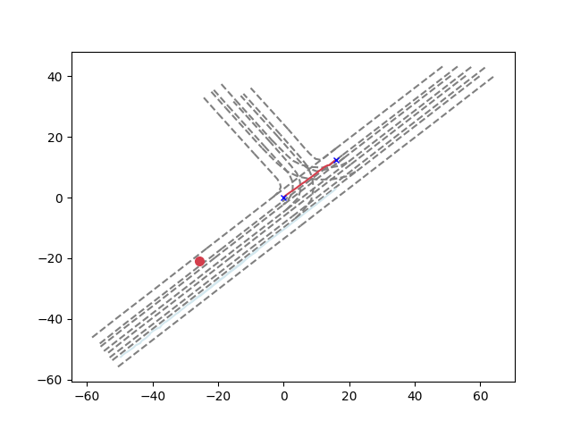

## vectorNet

论文地址：https://arxiv.org/pdf/2005.04259.pdf

把车道线和运动轨迹等抽象成不同的节点簇，构成一个subgraph，进行局部的特征融合

再把不同的polyline组成大的graph，卷积后，预测mask掉的节点的feature ，同时预测agent的轨迹，与ground truth进行比较。

### 1.轨迹和地图的表示

​	将一小段时间或者空间内的运动轨迹或车道线，抽象成一个节点，它属于整个轨迹（车道线）折线条图。节点的特征为起点坐标ds=xy，终点坐标de=xy，属性特征a（比如障碍物类型、时间戳、限速等），节点在子图中的ID=j。为了使输入的节点特征不受agent位置的影响，论文将所有向量的坐标归一化，使其以agent目标最后观测时间的位置为中心。

### 2.子图构建

​	子图P中的每个节点都属于同一条折线，P={v1,v2,……,vp}，子图前向传播过程的公式和图解如下：

​	stetp1:  genc函数：MLP模型（FC+norm+Relu）。

​	step2:  agg函数：邻居节点特征整合，最大池化层。  

​	step3:  rel函数：特征整合，拼接的方式。  

​	整个step1-step3为一层，模型堆叠了多个这样的层。不同层之间的genc参数是不同的，同层内节点之间参数共享。

​	最后整个折线的特征使用agg函数拼接得到。论文中提出当节点的起点和终点相同，并且a和l为空的时候，和PointNet相同。

### 3.全局图构建

​	折线特征更新过程如下，其中Pli(l和i分别为上下标)是第l层的折线特征，A是不同折线之间交互的全局图，这里使用了全连接的图。

​	GNN是attention的计算方式，先分别经过线性变换得到PQ，PK，PV，再PQ和PK相乘经过softmax后得到注意力系数，最后累加求和，更新特征。推理时，只需要更新agent的节点特征。

​	在经过t层GNN之后(代码里使用了1层，可以堆叠多层)，得到的折线特征再使用一个MLP进行解码，来预测未来的运动轨迹。

​	在训练时，模型也随机Mask掉了一些Polyline_node特征，使用一个MLP解码器进行预测，以提升模型性能。这个部分不在推理时使用。为了区分mask掉的node，会根据其最小的起点算一个标识特征Pid，故初始node特征为：

### 4.损失函数

​	损失函数包括两部分，预测轨迹的negative Gaussian log-likelihood损失和node特征重构的Huber损失。node 特征在进入Global net之前做了L2归一化。

预测的轨迹和LaneGCN相同，都是相对最后时刻中心位置的相对位移，然后进行坐标系转换和ground truth值进行比较。

## 代码实现

### 1.数据预处理部分

参考 https://github.com/xk-huang/yet-another-vectornet

预处理入口：compute_feature_module.py   读文件调用   compute_feature_for_one_seq函数

时间戳归一化（减去最小值）

位置归一化标准（last_obs的位置）norm_center

**get_nearby_lane_feature_ls**函数根据agent位置得到周围30米内的的laneid，并得到其traffic_control，is_intesection属性以及centerlane，并根据centerline计算的到其左右车道的边缘线坐标（**使用函数get_halluc_lane，这块利用argose提供的get_lane_segment_polygon函数计算感觉能更好一点**)，输出的三维结果是包含高度

最终lane的属性为[左车道线坐标9\*6，右车道线坐标9\*6，交通管控bool，路口bool，lane_id-int] ，6维是因为包含了高度值。

自定义代码得到的lane：

调用get_lane_segment_polygon得到的lane：

可以发现比较相似

**get_nearby_moving_obj_feature_ls**函数根据AGENT来筛选上下文的Obj，条件太严？返回都为空—>解决：测试集的obj序列长度为20，单独拎出去处理

**get_agent_feature_ls**函数用来处理agent属性，

最终返回值：xys是前20个时刻的vector19\*4（减去norm_center了），str的AGENT类型，ts是vector两点的平均 时间戳，str的track_id，gt_xys是后30个时刻的位置（减去norm_center了）

encoding_features函数：把agent，obj，和lane的feature都堆积到data里，然后调用save_features进行保存

**最后保存的data格式：**

"POLYLINE_FEATURES"：保存了所有的agent,obj,和lane的特征，都是8维，其中traj的特征是（xs, ys, xe, ye, timestamp, NULL, NULL, polyline_id），lane的特征是(xs, ys, xe, ye, NULL, zs, ze, polyline_id)

"GT"：30个时刻的相对last_obj坐标

"TRAJ_ID_TO_MASK"：字典,保存Traj的数据索引{0:(0,19),1:(19,38),2:(38,57)}

"LANE_ID_TO_MASK"：字典,保存Traj的数据索引{3:(0,9),1:(9,18),2:(18,27)……}

 "TARJ_LEN"：traj数量

"LANE_LEN"：lane数量