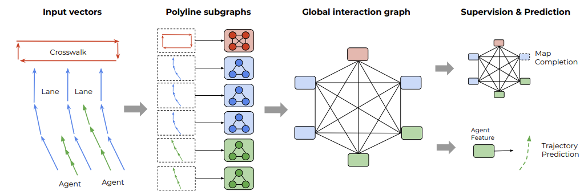
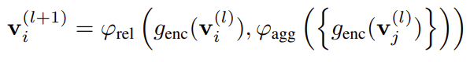
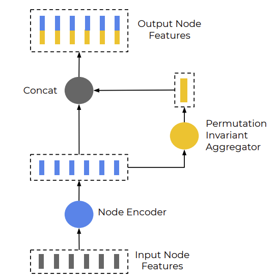
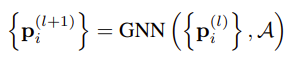
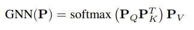
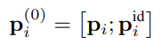

## vectorNet

论文地址：https://arxiv.org/pdf/2005.04259.pdf   
参考：https://github.com/DQSSSSS/VectorNet

把车道线和运动轨迹等抽象成不同的节点簇，构成一个subgraph，进行局部的特征融合

再把不同的polyline组成大的graph，卷积后，预测mask掉的节点的feature ，同时预测agent的轨迹，与ground truth进行比较。

### 1.轨迹和地图的表示

​	将一小段时间或者空间内的运动轨迹或车道线，抽象成一个节点，它属于整个轨迹（车道线）折线条图。节点的特征为起点坐标ds=xy，终点坐标de=xy，属性特征a（比如障碍物类型、时间戳、限速等），节点在子图中的ID=j。为了使输入的节点特征不受agent位置的影响，论文将所有向量的坐标归一化，使其以agent目标最后观测时间的位置为中心。



### 2.子图构建

​	子图P中的每个节点都属于同一条折线，P={v1,v2,……,vp}，子图前向传播过程的公式和图解如下：





​	stetp1:  genc函数：MLP模型（FC+norm+Relu），是多层的，并且整个sub-graph也是多层的（3层）。

​	step2:  agg函数：邻居节点特征整合，最大池化层。  

​	step3:  rel函数：特征整合，拼接的方式。  

​	整个step1-step3为一层，模型堆叠了多个这样的层。不同层之间的genc参数是不同的，同层内节点之间参数共享。

​	最后整个折线的特征使用agg函数拼接得到。论文中提出当节点的起点和终点相同，并且a和l为空的时候，和PointNet相同。

### 3.全局图构建

​	折线特征更新过程如下，其中Pli(l和i分别为上下标)是第l层的折线特征，A是不同折线之间交互的全局图，这里使用了全连接的图。





​	GNN是attention的计算方式，先分别经过线性变换得到PQ，PK，PV，再PQ和PK相乘经过softmax后得到注意力系数，最后累加求和，更新特征。推理时，只需要更新agent的节点特征。

​	在经过t层GNN之后(代码里使用了1层，可以堆叠多层)，得到的折线特征再使用一个MLP进行解码，来预测未来的运动轨迹。

​	在训练时，模型也随机Mask掉了一些Polyline_node特征，使用一个MLP解码器进行预测，以提升模型性能。这个部分不在推理时使用。为了区分mask掉的node，会根据其最小的起点算一个标识特征Pid，故初始node特征为：



### 4.损失函数

​	损失函数包括两部分，预测轨迹的negative Gaussian log-likelihood损失和node特征重构的Huber损失。node 特征在进入Global net之前做了L2归一化。

预测的轨迹和LaneGCN相同，都是相对最后时刻中心位置的相对位移，然后进行坐标系转换和ground truth值进行比较。

## 代码实现

### 1.数据预处理部分  

代码结构参考lanegcn的预处理过程  

**处理过程**：  

​	时间戳归一化（减去最小值）  

​	位置归一化标准（根据last_obs的位置）并rot  

​	traj的特征：xs, ys, xe, ye, type, start_time, end_time, speed, polyline_id（不足20的补0）  

​	lane的特征：xs, ys, xe, ye, type, traffic_control, turn_direction, intersection, polyline_id  

其中：type：AGENT=0， ctx_traj=1，lane=2  

​			direction:  left=1，right=2，None=0  

​			 traffic_control,intersection：true=1， false=0  

**最终data保存**：  

​			'item_num'：polyline数量  

​			'polyline_list'：polyline的特征，每个polyline包含的vector数量不同，但vector的特征长度都为9  
​			'rot'：保存旋转矩阵  
​			'gt_preds'：保存agent的future 坐标   
​			'has_preds'：未来30个时刻gt_preds是否有值  
​			'idx'：data index

### 2.问题
数据加pad后，每个data里的polyline数量为330（obj:30, lane:150*2），每条polyline中包含的vector数量都为19。vector特征长度为9   

1. 报错‘RuntimeError: CUDA error: device-side assert triggered’，报错原因不清晰   

   解决方法：一般为索引越界等问题，仔细检查传入的lable范围；若没有报错位置，切到CPU上跑模型，定位bug。  

2. 多GPU训练模型时，报错“RuntimeError:Expected tensor for argument #1 'input' to have the same devise as tensor for augument”   

   原因：数据位置不一样，也可能和函数调用有关系，定位bug,检查修改网络模型或者单GPU跑模型   
         另外发现使用nn.DataParallel时，在`model.to(device)`之后，存在部分模型并没有放在指定设备上的问题，debug查看其所在的设备，
   然后`.to(参数.device)`。*待完成：使用nn.DistributeDataParallel代替DP*
   
3. pycharm里可以设置根目录，代码运行正常，但是传到服务器之后提示找不到模块，主要是config文件的导入报错  
   
   原因：Linux里系统文件路径没有添加进相关的路径
   
   解决方法：可以更改环境变量，缺点是换个服务器就要改一次，更推荐下面的解决方法
   ```python
   from pathlib import Path  #利用pathlib包

   path = Path(__file__).parents[0]   #得到当前目录
   root_path = os.path.dirname(path)   #得到前两级目录
   sys.path.append(path)   #将其加入到系统目录里
   #sys.path.insert(0,path)   # 也可以使用insert，在加入系统目录的同时调高优先级
   from Vectornet_ning.config import *   #加外层包名
   
   #这种修改方式只在当前文件的运行期有效，运行结束后系统目录恢复到默认值
   ```
4. 预处理时，报错OOM，定位到pin_memory, 查看[官方文档](https://pytorch.org/docs/stable/data.html?highlight=dataloader#torch.utils.data.DataLoader) 。  

   设置pin_memory=False即可。pin_memory是锁页内存，创建DataLoader时，设置pin_memory=True，则意味着生成的Tensor数据最开始是属于内存中的锁页内存，这样将内存的Tensor转义到GPU的显存就会更快一些。
   主机中的内存，有两种存在方式，一是锁页，二是不锁页，锁页内存存放的内容在任何情况下都不会与主机的虚拟内存进行交换（注：虚拟内存就是硬盘），而不锁页内存在主机内存不足时，数据会存放在虚拟内存中。显卡中的显存全部是锁页内存,当计算机的内存充足的时候，可以设置pin_memory=True。当系统卡住，或者交换内存使用过多的时候，设置pin_memory=False。
5. argoverse数据集预处理后，文件比较大，在训练时读取数据比较慢。
   *待解决：dataset初始化读数据修改，dataloader多文件加载。*
